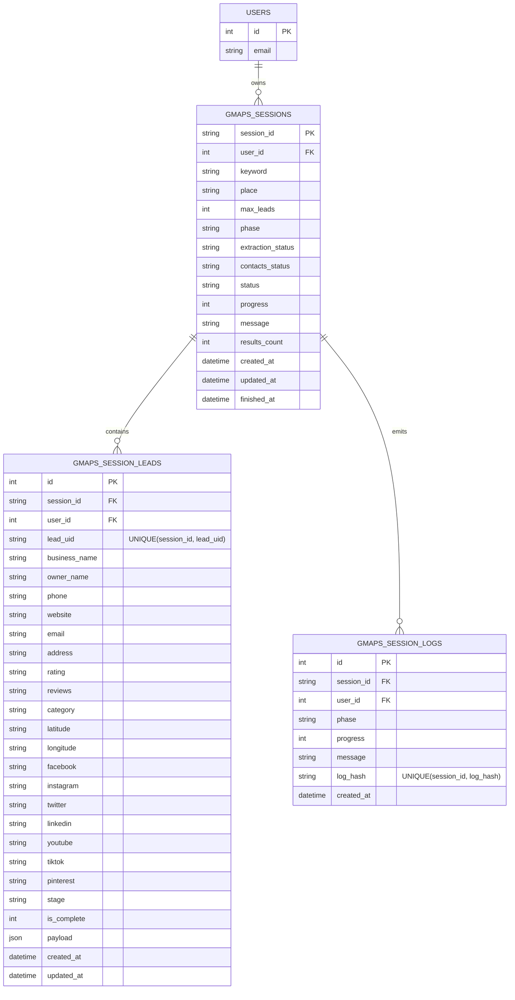

# Google Maps Session Data Model (Industry-Grade)

This model supports:

- Two-stage processing (`extract` → `contacts`)
- Live partial persistence while jobs are running
- Resume/restart by `session_id`
- Preview/download from persisted data even when crawler is still running

## ER Diagram

## Why this works

- `gmaps_sessions` stores lifecycle and control-plane state for each run.
- `gmaps_session_leads` stores each lead as an upserted row using `(session_id, lead_uid)`.
- `gmaps_session_logs` stores append-only runtime events for observability.
- APIs can read from memory first, then durable DB fallback for resilience.
- Download/preview uses persisted leads, so list remains available during contact crawling.
